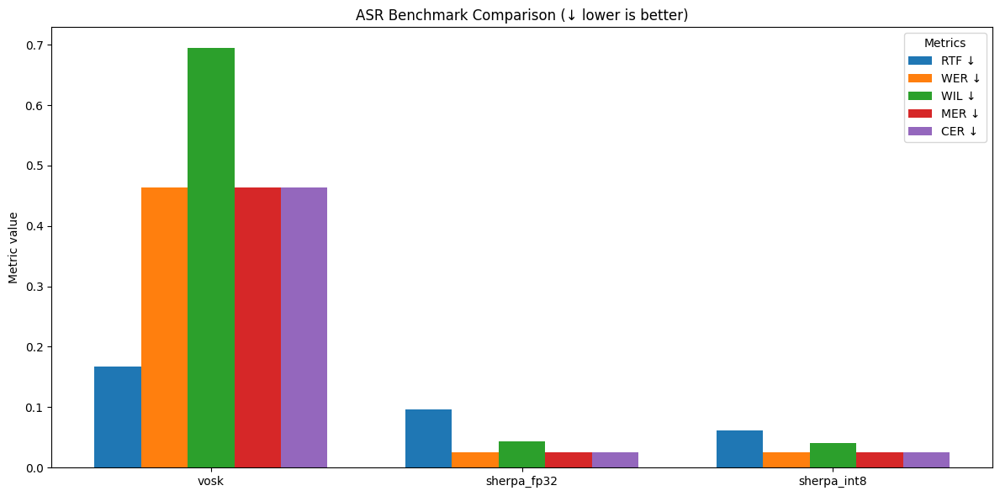

# tts-asr-benchmark

## Setup

1. Install models' weight
2. Install requirements based on model type

Model URLs:

TTS: [Link](https://github.com/k2-fsa/sherpa-onnx/releases/download/tts-models/vits-piper-vi_VN-vais1000-medium.tar.bz2)

```bash
wget https://github.com/k2-fsa/sherpa-onnx/releases/download/tts-models/vits-piper-vi_VN-vais1000-medium.tar.bz2
tar xvf sherpa-onnx-zipformer-vi-int8-2025-04-20.tar.bz2
rm sherpa-onnx-zipformer-vi-int8-2025-04-20.tar.bz2
```

ASR: [Link](https://github.com/k2-fsa/sherpa-onnx/releases/download/asr-models/sherpa-onnx-zipformer-vi-int8-2025-04-20.tar.bz2)

```bash
wget https://github.com/k2-fsa/sherpa-onnx/releases/download/asr-models/sherpa-onnx-zipformer-vi-int8-2025-04-20.tar.bz2
tar xvf sherpa-onnx-zipformer-vi-int8-2025-04-20.tar.bz2
rm sherpa-onnx-zipformer-vi-int8-2025-04-20.tar.bz2
```

3. Run benchmark
   
